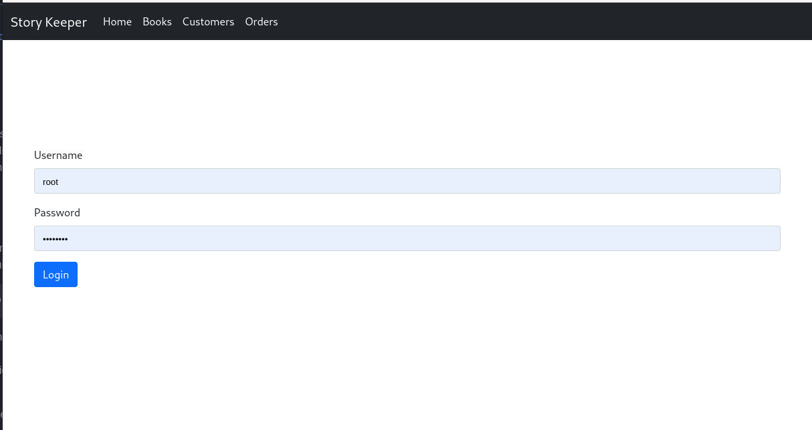

# Story Keeper

## Development Environment Setup
1. Spring Cli Required Download and install from:<br>
   1. https://docs.spring.io/spring-boot/docs/current/reference/html/getting-started.html#getting-started.installing.cli<br>
2. JDK 1.8 (Java 8) Required and needs to be set to default<br>
   1. WINDOWS: https://access.redhat.com/jbossnetwork/restricted/listSoftware.html?downloadType=distributions&product=core.service.openjdk&version=1.8.0.292<br>
   2. DEB Based Package Manager (Ubuntu): sudo apt install openjdk-8-jdk<br>
       a. Remember to update PATH in .bashrc or .profile file under your home profile...Google it!<br>
   3, For all other Operating Systems...Google it!<br>
3. Maven is Required:<br>
   1. https://maven.apache.org/download.cgi<br>

## IDE Setup
1. Make sure IDE is using JDK 8.<br>
   1. Check with IDE instructions on how to set the SDK version<br>
2. Open the pom.xml file in the editor<br>
3. Right-Click in the open pom.xml file in the editor and select Maven-> Reload Project. This will download the required Maven/Spring Dependencies<br>

## The App and Database Uses Docker Container Technology

### The mongo database container needs to be setup before first
1. Comment out the storykeeper service priot to proceeding<br>
    a. open the docker-compose.yml file from the project root directory in any text editor<br>
    b. highlight the following portion of the file.<br>
```
  storykeeper:
    build:
      context: .
      dockerfile: ./dockerfile
    image: storykeeper-app
    container_name: storykeeper-app
    depends_on:
      - mongodb
    ports:
      - "8080:8080"
```
   c. Press Ctrl+/ on the keyboard to comment out this section.<br>
   d. The repository starts with the mongoexpress container already commented out, uncomment the following section for development and setup of the database<br>
```
  #   mongo-express:
  #     container_name: mongo-express
  #     image: mongo-express
  #     ports:
  #       - '9001:8081'
  #     environment:
  #       - ME_CONFIG_MONGODB_SERVER=mongodb
  #       - ME_CONFIG_MONGODB_PORT=27017
  #       - ME_CONFIG_MONGODB_ADMINUSERNAME=storykeeperroot
  #       - ME_CONFIG_MONGODB_ADMINPASSWORD=storykeeperpassword
  #     depends_on:
  #       - mongodb
```
2. Save the file<br>
4. Change directory to the root of the project directory in a terminal or cmd prompt in windows and run the following command<br>
```
docker-compose up -d
```
5. Check Docker Status by running the following command in the termina/cmd prompt:<br>
```aidl
docker ps
```
7. The following containers should be Up and listed as such:<br>
```
CONTAINER ID   IMAGE           COMMAND                  CREATED       STATUS       PORTS                                           NAMES
1f29a80479c6   mongo-express   "tini -- /docker-ent…"   4 hours ago   Up 4 hours   0.0.0.0:9001->8081/tcp, :::9001->8081/tcp       mongo-express
6e376c4e70f9   mongo           "docker-entrypoint.s…"   3 days ago    Up 4 hours   0.0.0.0:27017->27017/tcp, :::27017->27017/tcp   mongodb
```
8. *** mongo-express may fail to start ***<br>
9. Run the following<br>
```
docker ps -a
```
10. From the output copy the CONTAINER ID for the mongo-express container and enter the following:<br>
```
docker start <enter the CONTAINER ID here>
```
11. Recheck the status of running containers with<br>
```
docker ps
```

## Database Setup
1. Navigate to the following url in the browser if you have mongo-express container running:<br>
   1. localhost:9001<br>
2. Type: 'storykeeperdb' into the Create Database Input for the Database name:<br>

3. and Click the +Create Database Button.<br>
4. You are now ready to RUN/DEBUG the Storykeeper Spring Application from any Java IDE, I prefer Intellij<br>

## Run the project
*** IF YOU ARE RUNNING THE APP FROM THE IDE YOU MUST CHANGE A PROPERTY IN THE APPLICATION.PROPERTIES FILE IN THE RESOURCES DIRECTORY ******<br>
*** CHANGE spring.data.mongodb.host=mongodb TO spring.data.mongodb.host=localhost ***<br>

1. Start the application by executing debug/run on the StorykeeperDataApplication.java class<br>
2. The Spring Cli should report building of the database collections and finally report:<br>
```aidl
2022-03-25 00:02:53.835  INFO 28795 --- [  restartedMain] e.c.s.StorykeeperDataApplication         : Springboot and mongodb sequence id generator started successfully.
```
3. Navigate to thhe following url in the browser:<br>
   1. localhost:8080<br>
   2. The Story Keeper Application Login screen should be shown:<br>


## Containerize the Storykeeper app for production environment<br>
1. After developing and debugging perform the following steps<br>
2. Uncomment storykeeper service in the docker-compose.yml file, recommend commenting out the mongo-express container service for security purposes<br>
3. Change directory to the root of the project folder in the terminal/cmd prompt<br>
4. Run the following command to teardown the initial docker containers:<br>
```
docker-compose down
```
5. No container should be listed when checking running containers by entering the following cmd:<br>
```
docker ps
```
6. Build the storykeeper container and start the application:<br>
   a. In the root directory of the project run the following<br>
   ```
   mvn clean
   ```
   b. Then the following:<br>
   ```
   docker-compose up -d
   ```
7. ALL DONE! Now the app is running in a container along with the mongo database container.<br>


# Docker Container Shutdown
1. Navigate to the root directory of the storykeeperdata project and run the following:<br>
```aidl
docker-compose down
```
## Remove Persistant Docker Volumes
1. Run the Docker command to list the Docker volumes:<br>
```aidl
docker volume ls
```
2. Run the following command to remove each volume:<br>
```aidl
docker volume rm <paste the id of the volume here>
```

## Remove Old Docker Containers
1. Run the following to list the docker containers including inactive:<br>
```aidl
docker ps -a
```
2. Run the following command to remove an old container if any exist:<br>
```aidl
docker rm <paste docker ID here>
```

## The Project is in work 
  
